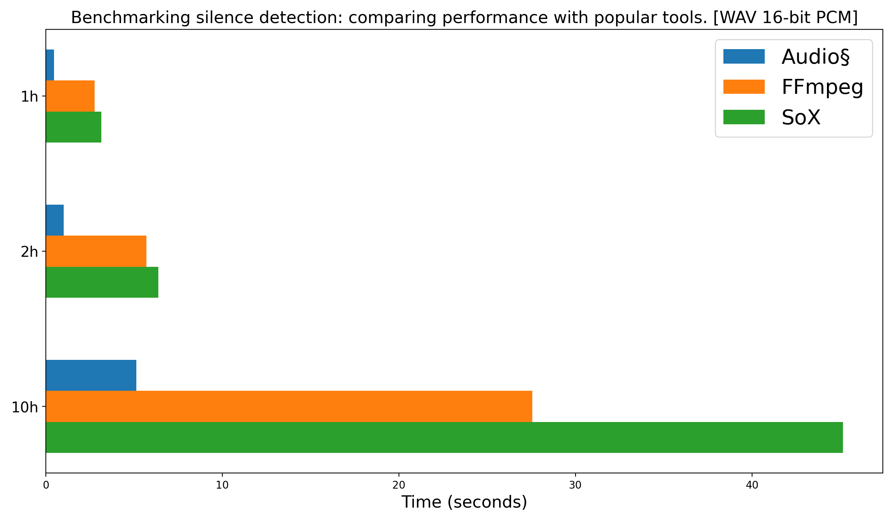
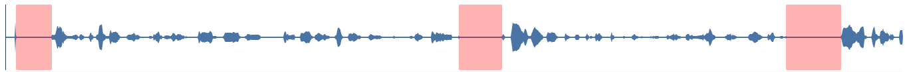
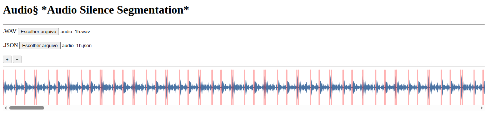

# Audio§ *Audio Silence Segmentation*

Audio§ is an open-source tool written in C for efficient silence detection in .wav audio files, optimized for speed and accuracy. Only 16-bit PCM is supported at the moment.

It currently uses a threshold-based algorithm similar to FFmpeg’s implementation, without relying on Root Mean Square (RMS) analysis. However, optional RMS-based detection is planned for future releases to offer more control and precision in audio analysis. Support for silence detection using SIMD (AVX/SSE) with larger frame blocks is planned for a future version.

The tool is also designed with machine learning workflows in mind. Segmentation results can be exported in .txt or .json formats, making it easy to generate labeled datasets for training AI models, such as silence classifiers and Voice Activity Detection (VAD) systems.

### Benchmarking silence detection: comparing performance with popular tools.




> **Audio§:** Web-based audio visualization for a 1-hour recording. The same accuracy as other tools, but faster.


> **FFmpeg:** Web-based audio visualization for a 1-hour recording.



> 🔊 This is a visualization of a **1-hour** audio file that was successfully processed and detected by **Audio§**. We use [wavesurfer.js](https://wavesurfer-js.org/) for visualizing the data on the web.

### Usage
```
Usage: audio§ <wav_file> [options]
Options:
  -threshold <int>          Silence threshold (default: 500)
  -min_duration <float>     Minimum silence duration in seconds (default: 1.0)
  -output_format <txt|json> Output format (default: NULL)
  -output_file <name>       Output file (default: NULL)
  -verbose <0|1>            Verbosity (default: 1)
  -h, --help                Show this help message
```

### Exemples
```bash
audio§ audio.wav -threshold 1000 -min_duration 0.4 -output_file output/audio.json -output_format json -verbose 0
```
audio.json
```json
[
  {
    "channel":0,
    "silence_start":0.15781249999999999,
    "silence_end":0.70243750000000005,
    "silence_duration":0.54462500000000003
  },
  {
    "channel":0,
    "silence_start":6.8228125000000004,
    "silence_end":7.4719375000000001,
    "silence_duration":0.64912499999999973
  },
  {
    "channel":0,
    "silence_start":11.7388125,
    "silence_end":12.5678125,
    "silence_duration":0.82900000000000063
  },
  {
    "channel":0,
    "silence_start":17.575749999999999,
    "silence_end":18.234562499999999,
    "silence_duration":0.6588124999999998
  }
]

```


```bash
audio§ audio.wav -threshold 1000 -min_duration 0.4 -output_file output/audio.txt -output_format txt -verbose 0
```
audio.txt
```
0 0.158 0.702 0.545
0 6.823 7.472 0.649
0 11.739 12.568 0.829
0 17.576 18.235 0.659
```
> FORMAT: channel silence_start silence_end silence_duration

### Prerequisites

Before compiling and running the project, make sure the following dependencies are available on your system:

- [json-c](https://github.com/json-c/json-c) – C library for handling JSON data.  
  On Debian/Ubuntu systems, you can install it with:
  sudo apt install libjson-c-dev

- [dr_wav](https://github.com/mackron/dr_libs) – Single-header C library for reading `.wav` files.  
  This project includes a local copy of dr_wav.h, so no separate installation is needed.

### Build

1. Clone the repository:
  ```bash
  git clone https://github.com/patrick-mns/audioss.git
  ```

2. To build the project (Linux):
  ```bash
  make
  ``` 

## 📝 License

This project is licensed under the [MIT License](LICENSE).